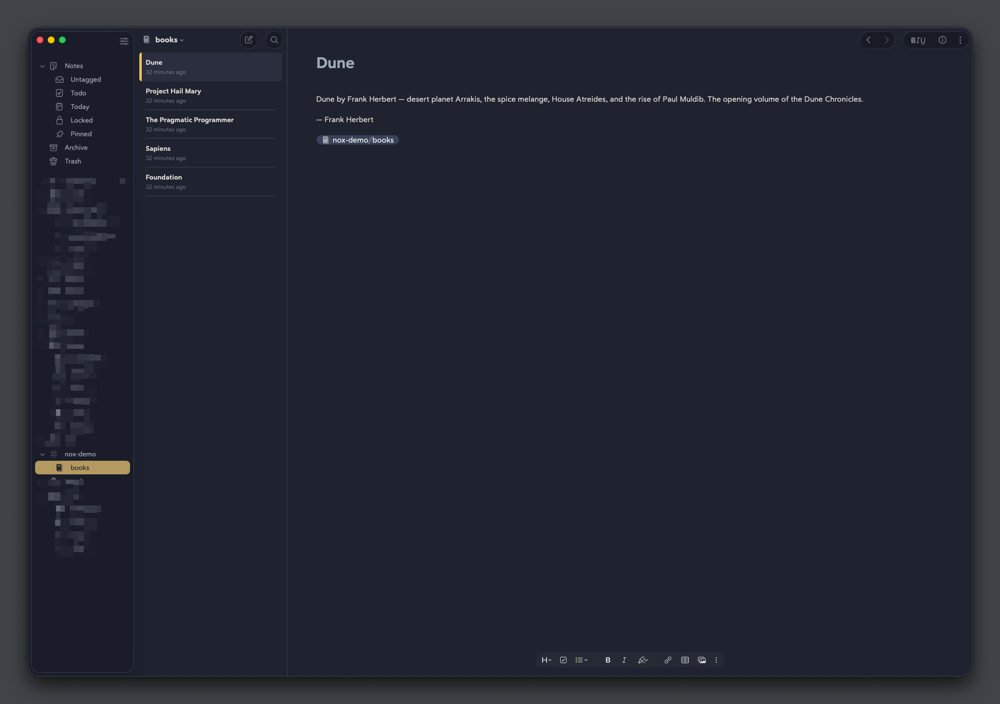
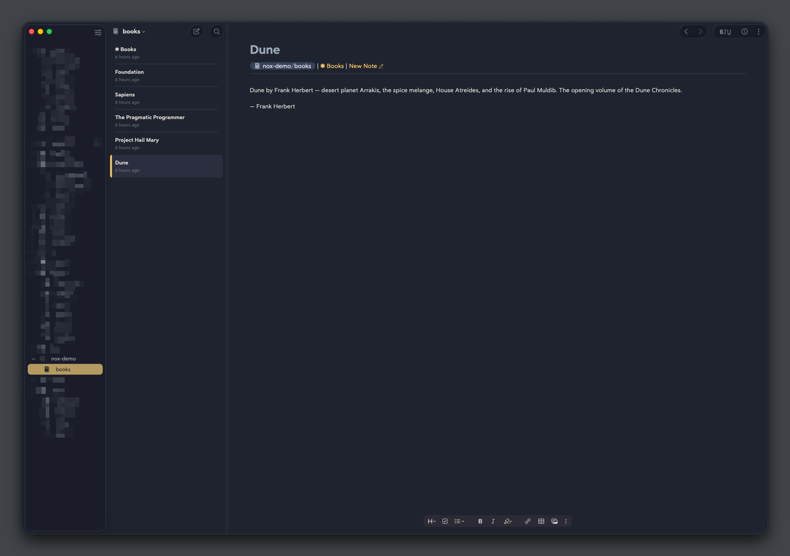
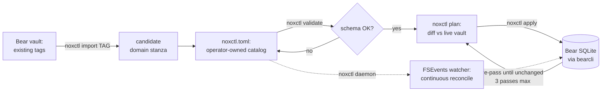
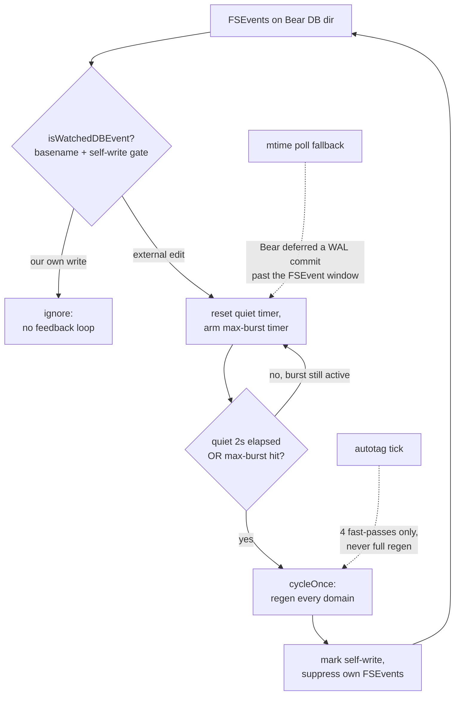

<p align="center">
  
</p>

# noxctl

[](#quick-start)
[](#status--scope)

[](https://github.com/barad1tos/noxctl/actions/workflows/build.yml)
[](https://github.com/barad1tos/noxctl/actions/workflows/codeql.yml)
[](https://codecov.io/gh/barad1tos/noxctl)
[](go.mod)
[](LICENSE)
[](#status--scope)
[](https://pkg.go.dev/github.com/barad1tos/noxctl)

Declarative macOS CLI for Bear notes structure management — *Terraform for Bear notes*. Describe your Bear-vault layout (tags, hubs, masters, buckets) in a TOML file and `noxctl` keeps the vault matching that description idempotently.

Brownfield — descended from a personal FSEvents-driven daemon (`regen-watchd`) that managed a 28-domain Bear corpus. The closed catalog of five rendering blueprints (`flat-list`, `grouped-vertical`, `hub-routed`, `hub-routed-with-subtag`, `umbrella`) covers every shape that production used.

**Standing on two shoulders.** The *what* comes from [Forever ✱ Notes](https://www.myforevernotes.com/) — a framework for organizing a knowledge vault around clickable master/hub notes (the `✱` master marker noxctl stamps on every index title is borrowed straight from it). The *how* comes from Terraform — declarative desired-state config plus `plan`/`apply` idempotent convergence. noxctl is Forever Notes' structure, maintained the Terraform way: describe the vault you want once, and the tool keeps it that shape.

## Contents

- [What noxctl does to your vault](#what-noxctl-does-to-your-vault)
- [noxctl vs. Forever Notes](#noxctl-vs-forever-notes)
- [Quick start](#quick-start)
- [Safety & recovery](#safety--recovery)
- [From existing vault](#from-existing-vault)
- [Status & scope](#status--scope)
- [Subcommands](#subcommands)
- [Choosing a blueprint](#choosing-a-blueprint)
- [Idempotency contract](#idempotency-contract)
- [How it works](#how-it-works)
- [Configuration shape](#configuration-shape)
- [Build & gates](#build--gates)
- [Deploy (maintainer's setup)](#deploy-maintainers-setup)
- [What this is not](#what-this-is-not)
- [License](#license)

## What noxctl does to your vault

For each managed tag, noxctl writes two things to Bear:

1. **A master note** that lists every atom under the tag as a wikilink bullet (shape depends on the blueprint — flat list, bucketed table, or Tier-2 hubs).
2. **A canonical tag-line** stamped onto every atom — `#tag | [[Bucket]] | [Open](bear://…)` — so the wikilink resolves bidirectionally and the master can pick atoms up on every regen pass.

Atoms keep their human-authored body; noxctl only owns the canonical line at the top and the master/hub layout. Below is what one `flat-list` tag looks like before and after a first `noxctl apply`.

**Before** — three atoms tagged `#library/books`, no master:

```markdown
# Sapiens
A book by Yuval Noah Harari about human history.

#library/books
```

**After** — same atom plus a new `✱ Books` master listing all three:

```markdown
# Sapiens

#library/books | [Open](bear://x-callback-url/open-note?title=%E2%9C%B1%20Books)
---

A book by Yuval Noah Harari about human history.
```

```markdown
# ✱ Books

#library/books
---

## Notes (3)
- [[Sapiens]]
- [[Foundation]]
- [[The Pragmatic Programmer]]
```

Same `#library/books` tag rendered in Bear, before and after `noxctl apply`:

| Before                                                                                                    | After                                                                                                                                         |
|-----------------------------------------------------------------------------------------------------------|-----------------------------------------------------------------------------------------------------------------------------------------------|
|  |  |

(Demo vault is at `examples/demo-vault/` — `setup.sh` populates it under `#nox-demo/books` and the paired `noxctl.toml` manages exactly that tag.)

## noxctl vs. Forever Notes

[Forever ✱ Notes](https://www.myforevernotes.com/) is a *method*: you build the master/hub structure once and maintain it by hand, on the honor system. noxctl is that same structure made *declarative and self-maintaining* — you describe the target once in TOML and the engine keeps the vault matching it, reconciling drift on every `apply` (or continuously, under the daemon).

**What noxctl adds on top of the hand-run method:**

- **No manual upkeep** — masters and hubs are regenerated, not hand-edited. Add an atom and the next pass picks it up; you never forget to update a hub.
- **Consistency at scale** — twenty-plus tags stay in lockstep under one render contract. `noxctl apply` is idempotent by construction (`unchanged` in ≤ 3 passes), where hand-maintenance drifts as the vault grows.
- **Drift reconciliation** — rename a note, move an atom between buckets, or delete one, and the structure self-heals on the next cycle instead of rotting silently.
- **Bidirectional links for free** — every atom gets its canonical tag-line stamped automatically, so master→atom and atom→master both resolve without manual back-linking.

**Where Forever Notes is still the better pick:**

- **Zero setup, no code** — it's a framework, not a binary. Nothing to install, no CLI, no config file.
- **Any device** — it lives in Apple Notes, so it syncs to iPhone/iPad and you edit structure on mobile. noxctl is macOS + Bear + a terminal.
- **Full manual control** — if you *want* to hand-craft every hub, noxctl's automation is overhead you don't need.

In one line: if you live in Bear on a Mac and your vault is big enough that hand-maintaining hubs is a chore, noxctl automates that chore away. If you want a no-install, cross-device method you drive by hand, stay with Forever Notes.

## Quick start

noxctl has two entry paths that share the same install and the same `validate → plan → apply` tail. Your track is decided at Step 2.

**Step 1 — Install (both paths).**

```bash
go install github.com/barad1tos/noxctl/cmd/noxctl@latest
```

**Step 2 — Build your catalog.** Every catalog needs one `[meta]` header plus one `[[domain]]` block per managed tag. `noxctl init` always writes the `[meta]` header, so it is the starting point for both tracks.

```bash
mkdir -p ~/.config/noxctl
noxctl init ~/.config/noxctl/noxctl.toml   # writes [meta] + 3 worked examples
```

**Track A — starting from scratch.** Open the file and **replace** the three example `[[domain]]` blocks with your own tags. Each block names a `tag`, an `index_title`, and a `blueprint` (see [Choosing a blueprint](#choosing-a-blueprint)). The smallest useful catalog is one domain — [`examples/minimal.toml`](examples/minimal.toml) is a tested 1-domain starter.

**Track B — importing existing Bear tags.**

1. **Delete** the three example `[[domain]]` blocks `init` wrote — keep only the `[meta]` header.
2. For each tag you want managed, run `noxctl import <tag>` and append its emitted block:
   ```bash
   noxctl import library/poetry >> ~/.config/noxctl/noxctl.toml
   noxctl import research/papers >> ~/.config/noxctl/noxctl.toml
   ```
3. Open the file and tidy the inferred fields (`index_title`, bucket names, blueprint).

`import` is read-only and emits no `[meta]` of its own — that is why `init` seeds the header first. Deleting the examples in step 1 also avoids a duplicate-tag error if you import a tag `init` shipped as a sample. See [From existing vault](#from-existing-vault) for how inference picks a blueprint.

**Step 3 — Converge (both paths).**

```bash
noxctl validate ~/.config/noxctl/noxctl.toml          # schema check, no Bear I/O
noxctl plan --config ~/.config/noxctl/noxctl.toml     # preview the diff
noxctl apply --config ~/.config/noxctl/noxctl.toml    # write it to Bear
```

Optional: run `noxctl daemon --config ~/.config/noxctl/noxctl.toml` to keep the vault reconciled live as you edit notes in Bear.

## Safety & recovery

**Q: Can I undo a `noxctl apply`?**
There is no built-in undo button — noxctl rewrites notes through `bearcli`, which writes directly to Bear's SQLite store. Recovery routes through Bear itself: trashed notes stay in Bear's trash until you manually empty it; an atom whose canonical tag-line you don't like can be edited in Bear like any other note (the next `apply` will reconcile, but a destructive rewrite can be reverted manually). For a hub or master you no longer want, `noxctl destroy <tag>` moves the auto-generated notes to Bear's trash and strips the canonical line from atoms in place — body content is preserved.

**Q: How do I back up before the first apply?**
Bear ships a built-in backup in **File → Backup Database…** — recommended before the first `noxctl apply` on a corpus you care about. The exported `.bearbackup` archive is a self-contained snapshot you can restore from. noxctl writes nothing outside Bear's database except its own state files (`~/.cache/regen-watchd.log` for daemon logs and `.noxctl/state.json` for per-domain content hashes); those are safe to delete and noxctl will rebuild them on the next run.

**Q: Where do destroyed notes go?**
`noxctl destroy <tag>` calls `bearcli` to trash the auto-generated master and any hubs under the tag. Trashed notes stay in Bear's trash (recoverable via the Bear UI) until you empty it manually. Atom notes are NOT trashed by `destroy` — only their canonical tag-line (the top-of-body `#tag | …` line) is stripped; the human-authored body below stays intact in place.

## From existing vault

[Quick start Track B](#quick-start) covers the steps; this section explains how `noxctl import <bear-tag>` decides what to emit. It scans every note under the tag and infers a blueprint from observable structure — note count and sub-tag shape:

- **0 notes** → `flat-list` (the lowest-friction starter).
- **Every note shares one `#tag/<bucket>` sub-tag** → `grouped-vertical` with the observed buckets.
- **Anything else** → `flat-list` (the safe fallback).

`hub-routed` and `hub-routed-with-subtag` are not auto-detected — their Tier-2 hub signal overlaps with `grouped-vertical` at the canonical-line level, so you switch to them by hand in the emitted stanza. Output sample for one tag:

```toml
# noxctl import library/poetry — 47 notes scanned
# every note carries a single-segment sub-tag (4 distinct buckets observed).
#
# Paste the [[domain]] block below into your noxctl.toml
# (review the field values first — they are educated guesses).

[[domain]]
  tag         = "library/poetry"
  index_title = "✱ Poetry"
  blueprint   = "grouped-vertical"
  buckets        = ["Frost", "Rilke", "Heaney", "Plath"]
  unknown_bucket = "Other"
```

Import is non-destructive — it never writes to `noxctl.toml` itself or touches your Bear notes. The operator owns the catalog file; `import` just generates pasteable text.

Bulk multi-tag import (`noxctl import --all`) is on the roadmap. For now, run `import` per tag and concatenate output.

## Status & scope

- **Platform:** macOS only. Bear is macOS-only; the watcher uses FSEvents via `fsnotify`'s Darwin backend; the CLI bridge is `bearcli` at `/Applications/Bear.app/Contents/MacOS/bearcli`.
- **Runtime:** Go ≥ 1.26. The only non-stdlib runtime dependency is `github.com/fsnotify/fsnotify`. Adding a runtime dep is deliberate and requires justification.
- **Acceptance test:** byte-equivalent vault output against the legacy daemon for the maintainer's 28-domain corpus.
- **License:** MIT.

## Subcommands

```
noxctl validate [<config>]   strict TOML schema + dispatch checks (no Bear I/O)
noxctl plan                  Terraform-style diff vs the live vault
noxctl apply                 write the diff back to the vault (one-shot)
noxctl daemon                long-running FSEvents-driven watcher
noxctl audit                 read-only lint sweep across every managed tag
noxctl lint [--apply]        report or auto-fix structural defects
noxctl verify                hard gate: catalog ↔ vault alignment check
noxctl daemon-config         inspect resolved daemon configuration
noxctl destroy <tag>         remove all atoms + hub for a managed tag
noxctl import <bear-tag>     bootstrap a noxctl.toml stanza from Bear
noxctl init                  interactive wizard for a fresh config
noxctl version               print version + build metadata
```

`apply` is the one-shot reconciliation; the daemon runs the same engine on a debounce-2s FSEvents signal plus an `mtime` poll fallback for cases where Bear defers a SQLite WAL commit past the file-system event window. `audit` and `lint` operate on note structure (broken-H1 titles, malformed canonical tag-lines) without touching the hub/master layout `apply` owns.

## Choosing a blueprint

Five rendering blueprints, each fitting a distinct tag shape. Pick by walking the decision tree below; consult the table for the full comparison.

**Decision tree:**

- Are notes grouped under the tag at all?
  - **No** — every note is a peer, order doesn't matter → **`flat-list`**
  - **Yes** — one master, or a separate hub note per bucket?
    - **One master**, buckets rendered as `## Bucket (N)` H2 sections → **`grouped-vertical`** (you declare the bucket list; whether buckets also become Bear sub-tags is auto-decided by tag depth — top-level tag yes, already-2-level tag no)
    - **Separate Tier-2 hub note per bucket** — where do bucket names come from?
      - You declare them as sub-tags (`#tag/bucket`) → **`hub-routed-with-subtag`**
      - They're discovered from atom bodies (author / source) → **`hub-routed`**
- Want a top-level master that aggregates several other domains? → **`umbrella`**

**Comparison table:**

| Blueprint                | When to use                                                     | Required fields beyond the basics | Bucket source                            | Output shape                                      |
|--------------------------|-----------------------------------------------------------------|-----------------------------------|------------------------------------------|---------------------------------------------------|
| `flat-list`              | inbox / capture tags, no grouping                               | none                              | n/a                                      | one master with bullet list of every atom         |
| `grouped-vertical`       | bucketed collection in one master, operator-declared buckets    | `buckets`, `unknown_bucket`       | operator-declared (sub-tag or canonical 3rd segment, auto by tag depth) | one master with `## Bucket (N)` H2 per bucket     |
| `hub-routed`             | author / source grouping where bucket names live in atom bodies | `unknown_bucket`, `hub_h2_prefix` | atom canonical tag-line `[[Bucket Hub]]` | Tier-2: master lists hubs, each hub lists atoms   |
| `hub-routed-with-subtag` | hub-style layout but bucket names are sub-tags                  | `buckets`, `unknown_bucket`       | atom sub-tag `#tag/bucket`               | Tier-2: master lists hubs, each hub lists atoms   |
| `umbrella`               | aggregate multiple existing domains under one master            | `children`, `default_child`       | n/a                                      | master lists every child domain                   |

Required fields beyond the basics — every blueprint also needs `tag`, `index_title`, `blueprint`. See `examples/<blueprint>.toml` for a copy-pasteable starter per blueprint.

**What each blueprint produces (structure):**

All five masters render as a list, so a screenshot of the master alone barely
tells them apart — the difference is _what sits below each link_ and _where the
buckets come from_, not the master's surface. The schematic shows that structure
(`──→` means "the link opens this note"):

```text
flat-list                ✱ Master ── • atom   • atom   • atom

grouped-vertical         ✱ Master
                         ├─ ## Bucket A (N) ── • atom  • atom
                         └─ ## Bucket B (M) ── • atom
                         · atoms sit inline in the master; buckets operator-declared

hub-routed               ✱ Master ── ## Authors
                         ├─ [[Frost]] (12) ──→ ## Poems ── • poem  • poem
                         └─ [[Rilke]]  (8) ──→ …
                         · buckets discovered from atom CONTENT; tag stays flat (#library/poetry)

hub-routed-with-subtag   ✱ Master ── ## Categories
                         ├─ [[claude · sessions]] (15) ──→ • atom  • atom
                         └─ [[claude · memory]]   (18) ──→ …
                         · buckets are real #claude/* SUB-TAGS (shown in Bear's sidebar)

umbrella                 ✱ Master ── ## Divisions
                         ├─ [[✱ Poetry]]    (706) ──→ Poetry's own master (hub-routed)
                         └─ [[✱ Aphorisms]]  (47) ──→ Aphorisms' own master (grouped-vertical)
                         · links open OTHER domains, each with its own blueprint
```

`flat-list` and `grouped-vertical` put atoms directly in the master.
`hub-routed`, `hub-routed-with-subtag`, and `umbrella` share an index-of-links
master but diverge below it — content-derived hubs, sub-tag hubs, and whole
child domains respectively.

## Idempotency contract

Every change to the engine must keep `noxctl apply` reaching `unchanged` for every hub and master after at most three passes. Order-stabilization passes count toward that three — anything that needs more is a bug. The integration suite under `tests/bear/engine/` pins this contract.

## How it works

<details>
<summary><b>Full lifecycle — from import to live daemon</b> (click to expand)</summary>

### The journey of a tag

noxctl moves a tag through five stages: discover it, declare it, preview, converge, then optionally keep it converged.



1. **Import** (optional) — `noxctl import <tag>` scans the notes under an existing Bear tag, infers a likely blueprint, and prints a paste-ready `[[domain]]` stanza. Non-destructive: it writes nothing.
2. **Declare** — you own `noxctl.toml`. Each managed tag is one `[[domain]]` block naming its blueprint and fields.
3. **Validate** — `noxctl validate` runs the loader and every `Domain.Validate()` rule with zero Bear I/O. Typos surface as `noxctl.toml:LINE:COL: unknown field`.
4. **Plan / apply** — `plan` diffs the catalog against the live vault; `apply` writes it back through `bearcli`, re-running until every hub and master reports `unchanged` (the [idempotency contract](#idempotency-contract): ≤ 3 passes).
5. **Daemon** (optional) — `noxctl daemon` runs the same engine continuously, reconciling on every external edit. This is the step that makes noxctl closer to a **Kubernetes operator** than to one-shot Terraform: declarative desired state *plus* a reconciliation loop.

### Inside the daemon loop

The daemon watches Bear's SQLite directory via FSEvents. The hard part: noxctl's own writes also fire FSEvents, so a naive watcher would react to itself forever. A **self-write gate** and a **debounce window** prevent that.



- **Self-write gate** — before writing, the daemon marks the write as its own; the matching FSEvent is dropped instead of triggering another cycle. This is what keeps the loop from chasing its own tail.
- **Debounce + max-burst** — a flurry of edits (Bear sync, a paste, a bulk re-tag) collapses into one regen. The quiet timer waits for 2s of silence; the max-burst timer caps how long a never-quiet stream can defer a cycle.
- **mtime poll fallback** — Bear sometimes commits its SQLite WAL after the FSEvent window closes. A periodic `mtime` stat catches those and routes them through the same debounce path, so no edit is silently missed.
- **autotag fast-pass** — a lightweight tick running only the four tag-hygiene passes (foreign-tag escape, daily-default, domain-bootstrap, placeholder-refresh), never the full per-domain regen.

Every path converges on the same `cycleOnce`, and every `cycleOnce` honors the same `unchanged`-in-≤3-passes contract that `apply` does.

</details>

## Configuration shape

```toml
# noxctl.toml — minimal example
[meta]
  version = "1"
  locale  = "uk"

[[domain]]
  tag         = "library/poetry"
  index_title = "✱ Poetry"
  blueprint   = "hub-routed"
  unknown_bucket = "Unknown"
  hub_h2_prefix  = "Poems"

[[domain]]
  tag            = "library/aphorisms"
  index_title    = "✱ Aphorisms"
  blueprint      = "grouped-vertical"
  buckets        = ["Books", "Films", "Games"]
  unknown_bucket = "Unknown"
```

See `examples/minimal.toml` for a tested starter and `examples/personal.toml` for the maintainer's full 28-domain catalog covering every blueprint.

`noxctl validate` runs the loader plus every `Domain.Validate()` rule and exits zero in well under a second with zero `bearcli` calls. A typo'd field surfaces as `noxctl.toml:LINE:COL: unknown field` and aggregates every problem in one run.

## Build & gates

```bash
go build ./...                       # ~1 s
go vet ./...
golangci-lint run                    # gocognit/gocyclo ≤ 15, lll ≤ 120
go test ./... -count=1               # ~10 s, all packages
```

Pre-commit hooks live in `.pre-commit-config.yaml` — install once with `pre-commit install`.

## Deploy (maintainer's setup)

```bash
go install ./cmd/noxctl             # writes ~/go/bin/noxctl
launchctl bootout gui/$(id -u)/com.bear.regen-watchd 2>/dev/null
launchctl bootstrap gui/$(id -u) ~/Library/LaunchAgents/com.bear.regen-watchd.plist
```

`~/bin/noxctl` is a symlink to `~/go/bin/noxctl`; the launchd plist `ProgramArguments` points at `~/bin/noxctl daemon --config <path>`, so every `go install` is picked up without editing the plist. The launchd label still says `com.bear.regen-watchd` for continuity with operator history — only the program target moved.

## What this is not

- Not a Bear backup tool — it MUTATES notes in place.
- Not cross-platform — Bear, FSEvents, and `bearcli` are macOS-only.
- Not a general note-management framework — it operates on a closed catalog of five blueprints.

## License

MIT — see [LICENSE](LICENSE).
