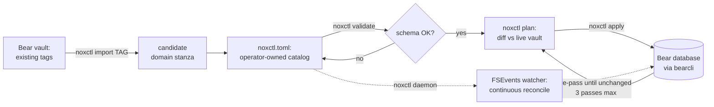
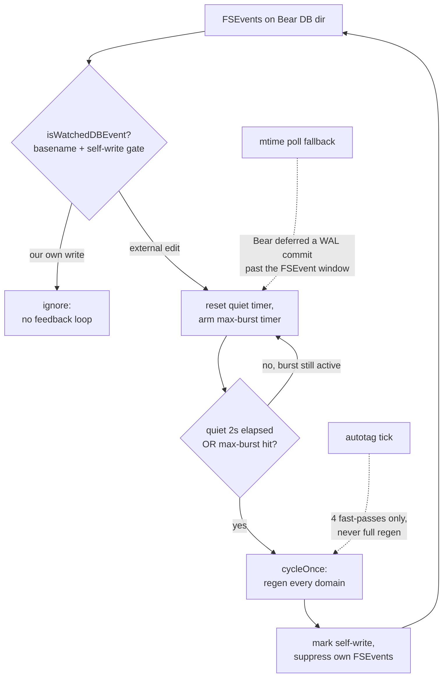

<p align="center">
  
</p>

# noxctl

[](#quick-start)
[](#status--scope)

[](https://github.com/barad1tos/noxctl/actions/workflows/build.yml)
[](https://github.com/barad1tos/noxctl/actions/workflows/codeql.yml)
[](https://codecov.io/gh/barad1tos/noxctl)
[](go.mod)
[](LICENSE)
[](#status--scope)
[](https://pkg.go.dev/github.com/barad1tos/noxctl)

Declarative macOS CLI for Bear notes structure management — *Terraform for Bear notes*. Describe your Bear-vault layout (tags, hubs, masters, buckets) in a TOML file and `noxctl` keeps the vault matching that description idempotently.

> **Pre-release note:** noxctl is in active development and is looking for feedback before the first stable release. It mutates Bear notes when you run `apply`, so read the safety notes and make a Bear backup before trying it on notes you care about.

**Standing on two shoulders.** The *what* is inspired by [Forever ✱ Notes](https://www.myforevernotes.com/) — a framework for organizing a knowledge vault around clickable master/hub notes (including the `✱` master marker noxctl stamps on generated index titles). The *how* comes from Terraform — declarative desired-state config plus `plan`/`apply` idempotent convergence. noxctl is Forever Notes-style structure, maintained the Terraform way.

## Contents

- [What noxctl does to your vault](#what-noxctl-does-to-your-vault)
- [Quick start](#quick-start)
- [One-shot vs daemon mode](#one-shot-vs-daemon-mode)
- [User-level trade-offs](#user-level-trade-offs)
- [Choosing a blueprint](#choosing-a-blueprint)
- [Status & scope](#status--scope)
- [What this is not](#what-this-is-not)
- [License](#license)

Everything else — comparison to Forever Notes, safety/undo, how `import` infers a blueprint, the full subcommand list, config shape, daemon internals, and build/deploy — lives in collapsible sections next to the topic it belongs to.

## What noxctl does to your vault

In plain English: noxctl is a structure maintainer for Bear. You still write normal notes in Bear. noxctl reads the rules from `noxctl.toml`, looks at the matching Bear tags, and creates or updates the generated structure around those notes: index notes, hub notes, grouped lists, and links.

For each managed tag, noxctl writes two things to Bear:

1. **A master note** that lists every atom — an individual note under the tag — as a wikilink bullet (shape depends on the blueprint — flat list, `## Bucket` H2 sections, or Tier-2 hubs).
2. **A canonical tag-line** stamped onto every atom — `#tag | [[Bucket]] | [Open](bear://…)` — so the wikilink resolves bidirectionally and the master can pick atoms up on every regen pass.

Atoms keep their human-authored body; noxctl only owns the canonical line at the top and the master/hub layout. Here is one `#library/books` tag in Bear, before and after a first `noxctl apply`:

| Before                                                                                                    | After                                                                                                                                         |
|-----------------------------------------------------------------------------------------------------------|-----------------------------------------------------------------------------------------------------------------------------------------------|
|  |  |

(Demo vault is at `examples/demo-vault/` — `setup.sh` populates it under `#nox-demo/books` and the paired `noxctl.toml` manages exactly that tag.)

<details>
<summary><b>See the raw note markdown (before / after)</b></summary>

**Before** — three atoms tagged `#library/books`, no master:

```markdown
# Sapiens
A book by Yuval Noah Harari about human history.

#library/books
```

**After** — same atom plus a new `✱ Books` master listing all three:

```markdown
# Sapiens

#library/books | [Open](bear://x-callback-url/open-note?title=%E2%9C%B1%20Books)
---

A book by Yuval Noah Harari about human history.
```

```markdown
# ✱ Books

#library/books
---

## Notes (3)
- [[Sapiens]]
- [[Foundation]]
- [[The Pragmatic Programmer]]
```

</details>

<details>
<summary><b>How does noxctl compare to Forever ✱ Notes?</b></summary>

[Forever ✱ Notes](https://www.myforevernotes.com/) is a *method*: you build the master/hub structure once and maintain it by hand, on the honor system. noxctl is that same structure made *declarative and self-maintaining* — you describe the target once in TOML and the engine keeps the vault matching it, reconciling drift on every `apply` (or continuously, under the daemon).

**What noxctl adds on top of the hand-run method:**

- **No manual upkeep** — masters and hubs are regenerated, not hand-edited. Add an atom and the next pass picks it up; you never forget to update a hub.
- **Consistency at scale** — twenty-plus tags stay in lockstep under one render contract. `noxctl apply` is idempotent by construction (`unchanged` in ≤ 3 passes), where hand-maintenance drifts as the vault grows.
- **Drift reconciliation** — rename a note, move an atom between buckets, or delete one, and the structure self-heals on the next cycle instead of rotting silently.
- **Bidirectional links for free** — every atom gets its canonical tag-line stamped automatically, so master→atom and atom→master both resolve without manual back-linking.

**Where Forever Notes is still the better pick:**

- **Zero setup, no code** — it's a framework, not a binary. Nothing to install, no CLI, no config file.
- **Any device** — it lives in Apple Notes, so it syncs to iPhone/iPad and you edit structure on mobile. noxctl is macOS + Bear + a terminal.
- **Full manual control** — if you *want* to hand-craft every hub, noxctl's automation is overhead you don't need.

In one line: if you live in Bear on a Mac and your vault is big enough that hand-maintaining hubs is a chore, noxctl automates that chore away. If you want a no-install, cross-device method you drive by hand, stay with Forever Notes.

</details>

## Quick start

noxctl has two entry paths that share the same install and the same `validate → plan → apply` tail. Your track is decided at Step 2.

**Step 1 — Install (both paths).**

```bash
go install github.com/barad1tos/noxctl/cmd/noxctl@latest
```

**Step 2 — Build your catalog.** Every catalog needs one `[meta]` header plus one `[[domain]]` block per managed tag. `noxctl init` always writes the `[meta]` header, so it is the starting point for both tracks.

```bash
mkdir -p ~/.config/noxctl
noxctl init ~/.config/noxctl/noxctl.toml   # writes [meta] + 3 worked examples
```

**Track A — starting from scratch.** Open the file and **replace** the three example `[[domain]]` blocks with your own tags. Each block names a `tag`, an `index_title`, and a `blueprint` (see [Choosing a blueprint](#choosing-a-blueprint)). The smallest useful catalog is one domain — [`examples/minimal.toml`](examples/minimal.toml) is a tested 1-domain starter.

**Track B — importing existing Bear tags.**

1. **Delete** the three example `[[domain]]` blocks `init` wrote — keep only the `[meta]` header.
2. For each tag you want managed, run `noxctl import <tag>` and append its emitted block:
   ```bash
   noxctl import library/poetry >> ~/.config/noxctl/noxctl.toml
   noxctl import research/papers >> ~/.config/noxctl/noxctl.toml
   ```
3. Open the file and tidy the inferred fields (`index_title`, bucket names, blueprint).

`import` is read-only and emits no `[meta]` of its own — that is why `init` seeds the header first. Deleting the examples in step 1 also avoids a duplicate-tag error if you import a tag `init` shipped as a sample. The collapsible section below explains how the inference picks a blueprint.

**Step 3 — Converge (both paths).**

```bash
noxctl validate ~/.config/noxctl/noxctl.toml          # schema check, no Bear I/O
noxctl doctor --config ~/.config/noxctl/noxctl.toml   # environment preflight, no Bear writes
noxctl plan --config ~/.config/noxctl/noxctl.toml     # preview the diff
noxctl apply --config ~/.config/noxctl/noxctl.toml    # write it to Bear
```

> **Before your first `apply`:** it mutates your local Bear database through Bear's bundled `bearcli` and has no built-in undo button — back up via **File → Backup Database…** first (details in *Safety, backup & undo* below).

Optional: run `noxctl daemon --config ~/.config/noxctl/noxctl.toml` when you want continuous reconciliation. The daemon does **not** install itself as a background service; see [One-shot vs daemon mode](#one-shot-vs-daemon-mode) if you want it to keep running after logout or reboot.

<details>
<summary><b>Safety, backup & undo</b></summary>

**Q: Can I undo a `noxctl apply`?**
There is no built-in undo button — noxctl rewrites notes through Bear's bundled `bearcli`, which mutates the local Bear database. Recovery routes through Bear itself: trashed notes stay in Bear's trash until you manually empty it; an atom whose canonical tag-line you don't like can be edited in Bear like any other note (the next `apply` will reconcile, but a destructive rewrite can be reverted manually). For a hub or master you no longer want, `noxctl destroy <tag>` moves the auto-generated notes to Bear's trash and strips the canonical line from atoms in place — body content is preserved.

**Q: How do I back up before the first apply?**
Bear ships a built-in backup in **File → Backup Database…** — recommended before the first `noxctl apply` on a corpus you care about. The exported `.bearbackup` archive is a self-contained snapshot you can restore from. noxctl writes no note data outside Bear except its own state files (`~/.cache/regen-watchd.log` for daemon logs and `.noxctl/state.json` for per-domain content hashes); those are safe to delete and noxctl will rebuild them on the next run.

**Q: Where do destroyed notes go?**
`noxctl destroy <tag>` calls `bearcli` to trash the auto-generated master and any hubs under the tag. Trashed notes stay in Bear's trash (recoverable via the Bear UI) until you empty it manually. Atom notes are NOT trashed by `destroy` — only their canonical tag-line (the top-of-body `#tag | …` line) is stripped; the human-authored body below stays intact in place.

</details>

<details>
<summary><b>How <code>import</code> picks a blueprint</b> (the inference behind Track B)</summary>

`noxctl import <bear-tag>` scans every note under the tag, reads a handful of structural signals, and walks a decision tree to a single recommendation — printed with a confidence grade, the metric that decided it, and a one-line rationale, above a paste-ready stanza. It is read-only: it never writes `noxctl.toml` or touches your notes.

**The signals it reads:**

- **Tag depth** — top-level (`recipes`) vs already-nested (`library/poetry`). A top-level tag can carry `#tag/bucket` sub-tags; a 2-level tag cannot (3-level tags are forbidden), so its buckets must live in note content.
- **Note count** — a small, ungrouped tag leans `flat-list`.
- **Bucket signal** — how many distinct buckets are observable, and what fraction of notes carry one (from a `#tag/bucket` sub-tag or an existing canonical line).
- **Atoms per bucket** — a bucket with many atoms earns its own Tier-2 hub; a thin one reads better inline.
- **Author signal** — the fraction of notes whose body carries a `## Author`-style H2, which points at content-derived buckets.

**How those map to a blueprint:**

| Observed shape                                  | Recommendation                                            |
|-------------------------------------------------|-----------------------------------------------------------|
| No usable bucket signal                         | `flat-list` (high confidence when small, medium when large) |
| Top-level tag, few atoms per bucket             | `grouped-vertical` (alternative: `hub-routed-with-subtag`)  |
| Top-level tag, many atoms per bucket            | `hub-routed-with-subtag` (alternative: `grouped-vertical`)  |
| Nested tag, strong author signal or many buckets| `hub-routed`                                              |
| Nested tag, a small declared bucket set         | `grouped-vertical`                                        |

This follows the *Choosing a blueprint* decision tree, with one extra shortcut the eyeball version omits: on a nested tag, a high distinct-bucket count alone is enough for `hub-routed` (even without an author signal), so the master stays a scannable list of hubs.

When two blueprints are a close call (the `grouped-vertical` ↔ `hub-routed-with-subtag` fork on a top-level tag), import prints the runner-up on an `# alternative:` line so you can flip it by intent. `umbrella` is never auto-suggested — it depends on sibling tags a single-tag scan cannot see; a vault-wide pass that detects umbrellas is on the roadmap.

**Sample output:**

```toml
# noxctl import library/poetry — 47 notes scanned
# recommend: hub-routed (confidence: high; deciding metric: body_author_signal) — many content-derived buckets (authors/sources) — Tier-2 hubs
#
# Paste the [[domain]] block below into your noxctl.toml.

[[domain]]
  tag         = "library/poetry"
  index_title = "✱ Poetry"
  blueprint   = "hub-routed"
  unknown_bucket = "Other"
  hub_h2_prefix  = "Items"
```

Tidy the inferred fields (`index_title`, bucket names, `hub_h2_prefix`) before you paste — they are educated starting points, not final values. Bulk multi-tag import (`noxctl import --all`) is on the roadmap; for now, run `import` per tag and concatenate the output.

</details>

<details>
<summary><b>All subcommands</b></summary>

```
noxctl validate [<config>]   strict TOML schema + dispatch checks (no Bear I/O)
noxctl plan                  Terraform-style diff vs the live vault
noxctl doctor                read-only environment / config / daemon preflight
noxctl apply                 write the diff back to the vault (one-shot)
noxctl daemon                long-running FSEvents-driven watcher
noxctl audit                 read-only lint sweep across every managed tag
noxctl lint [--apply]        report or auto-fix structural defects
noxctl verify                hard gate: catalog ↔ vault alignment check
noxctl daemon-config         inspect resolved daemon configuration
noxctl destroy <tag>         trash generated masters/hubs and strip managed lines from atoms
noxctl import <bear-tag>     bootstrap a noxctl.toml stanza from Bear
noxctl init                  write an annotated starter config
noxctl version               print version + build metadata
```

`apply` is the one-shot reconciliation; the daemon runs the same engine on a debounce-2s FSEvents signal plus an `mtime` poll fallback for cases where Bear defers a SQLite WAL commit past the file-system event window. `audit` and `lint` operate on note structure (broken-H1 titles, malformed canonical tag-lines, orphan families, duplicate titles) without touching the hub/master layout `apply` owns.

</details>

## One-shot vs daemon mode

noxctl has two operating modes. Start with the one-shot mode until you trust the plan output on your own vault.

| Mode | What it does | When to use it | Persistence |
|------|--------------|----------------|-------------|
| `validate → plan → apply` | Runs once, shows a diff, then applies it only when you ask | First runs, careful changes, manual control | Exits after the command finishes |
| `daemon` | Runs continuously and reconciles managed structures when Bear changes | Mature configs you want kept in sync automatically | Lives only while the process is running unless you install a LaunchAgent |

Run the daemon manually when testing continuous reconciliation:

```bash
noxctl daemon --config ~/.config/noxctl/noxctl.toml
```

That process will stop when the terminal/session ends. noxctl does not install a background service by itself. On macOS, the user-level way to keep it alive after logout or reboot is a per-user `launchd` **LaunchAgent**.

> Use a LaunchAgent (`~/Library/LaunchAgents/...plist`), not a system LaunchDaemon. noxctl works with the current user's Bear data, so it should run in the same user context.

Example `~/Library/LaunchAgents/com.barad1tos.noxctl.plist`:

```xml
<?xml version="1.0" encoding="UTF-8"?>
<!DOCTYPE plist PUBLIC "-//Apple//DTD PLIST 1.0//EN" "http://www.apple.com/DTDs/PropertyList-1.0.dtd">
<plist version="1.0">
<dict>
  <key>Label</key>
  <string>com.barad1tos.noxctl</string>

  <key>ProgramArguments</key>
  <array>
    <string>/Users/YOUR_USER/go/bin/noxctl</string>
    <string>daemon</string>
    <string>--config</string>
    <string>/Users/YOUR_USER/.config/noxctl/noxctl.toml</string>
  </array>

  <key>RunAtLoad</key>
  <true/>

  <key>KeepAlive</key>
  <true/>

  <key>StandardOutPath</key>
  <string>/Users/YOUR_USER/Library/Logs/noxctl.log</string>

  <key>StandardErrorPath</key>
  <string>/Users/YOUR_USER/Library/Logs/noxctl.err.log</string>
</dict>
</plist>
```

Replace `YOUR_USER` and the binary path before loading it.

```bash
launchctl bootstrap gui/$(id -u) ~/Library/LaunchAgents/com.barad1tos.noxctl.plist
launchctl enable gui/$(id -u)/com.barad1tos.noxctl
launchctl kickstart -k gui/$(id -u)/com.barad1tos.noxctl
```

To stop and unload it:

```bash
launchctl bootout gui/$(id -u) ~/Library/LaunchAgents/com.barad1tos.noxctl.plist
```

## User-level trade-offs

noxctl is useful when Bear is still the place you want to write, but manual structure maintenance has become the annoying part.

| You gain | You trade away | Why it matters |
|----------|----------------|----------------|
| Generated index/hub notes | Some generated structure is now tool-owned | Edit your content freely, but do not hand-tune generated masters/hubs and expect those edits to survive regeneration |
| Reviewable `plan` output before writes | You need to understand the plan before applying it | Safer than silent automation, but still requires attention |
| Consistent structure across many tags | A config file becomes part of your note system | Your organization rules live in `noxctl.toml`, not only in your head |
| Optional live reconciliation | A long-running process may be running on your Mac | Great for stable configs, but start manually before installing a LaunchAgent |
| Obsidian-like organization depth inside Bear | macOS + Bear + terminal are required | This is for Bear power users on macOS, not a cross-platform no-code workflow |
| Faster cleanup of drift | Bad config can produce bad structure quickly | Always back up before first use and inspect `plan` output |

A good first test is one low-risk tag with a small number of notes. Import it, review the generated config, run `plan`, read the diff, back up Bear, and only then run `apply`.

## Choosing a blueprint

Five rendering blueprints, each fitting a distinct tag shape. Walk the decision tree to land on one; the collapsible section has the full comparison table and a structure diagram.

- Are notes grouped under the tag at all?
  - **No** — every note is a peer, order doesn't matter → **`flat-list`**
  - **Yes** — one master, or a separate hub note per bucket?
    - **One master**, buckets rendered as `## Bucket (N)` H2 sections → **`grouped-vertical`** (you declare the bucket list; whether buckets also become Bear sub-tags is auto-decided by tag depth — top-level tag yes, already-2-level tag no)
    - **Separate Tier-2 hub note per bucket** — where do bucket names come from?
      - You declare them as sub-tags (`#tag/bucket`) → **`hub-routed-with-subtag`**
      - They're discovered from atom bodies (author / source) → **`hub-routed`**
- Want a top-level master that aggregates several other domains? → **`umbrella`**

<details>
<summary><b>Full comparison table & structure diagram</b></summary>

| Blueprint                | When to use                                                     | Required fields beyond the basics | Bucket source                            | Output shape                                      |
|--------------------------|-----------------------------------------------------------------|-----------------------------------|------------------------------------------|---------------------------------------------------|
| `flat-list`              | inbox / capture tags, no grouping                               | none                              | n/a                                      | one master with bullet list of every atom         |
| `grouped-vertical`       | bucketed collection in one master, operator-declared buckets    | `buckets`, `unknown_bucket`       | operator-declared (sub-tag or canonical 3rd segment, auto by tag depth) | one master with `## Bucket (N)` H2 per bucket     |
| `hub-routed`             | author / source grouping where bucket names live in atom bodies | `unknown_bucket`, `hub_h2_prefix` | atom body H2 (author/source), stamped into the canonical line | Tier-2: master lists hubs, each hub lists atoms   |
| `hub-routed-with-subtag` | hub-style layout but bucket names are sub-tags                  | `buckets`, `unknown_bucket`       | atom sub-tag `#tag/bucket`               | Tier-2: master lists hubs, each hub lists atoms   |
| `umbrella`               | aggregate multiple existing domains under one master            | `children`, `default_child`       | n/a                                      | master lists every child domain                   |

Required fields beyond the basics — every blueprint also needs `tag`, `index_title`, `blueprint`. See `examples/<blueprint>.toml` for a copy-pasteable starter per blueprint.

All five masters render as a list, so a screenshot of the master alone barely
tells them apart — the difference is _what sits below each link_ and _where the
buckets come from_, not the master's surface. The schematic shows that structure
(`──→` means "the link opens this note").

<!-- Editor note: this schematic is whitespace-aligned and renders monospace
     inside the code fence below; keep the columns aligned when editing. -->

```text
flat-list                ✱ Master ── • atom   • atom   • atom

grouped-vertical         ✱ Master
                         ├─ ## Bucket A (N) ── • atom  • atom
                         └─ ## Bucket B (M) ── • atom
                         · atoms sit inline in the master; buckets operator-declared

hub-routed               ✱ Master ── ## Authors
                         ├─ [[Frost]] (12) ──→ ## Poems ── • poem  • poem
                         └─ [[Rilke]]  (8) ──→ …
                         · buckets discovered from atom CONTENT; tag stays flat (#library/poetry)

hub-routed-with-subtag   ✱ Master ── ## Categories
                         ├─ [[claude · sessions]] (15) ──→ • atom  • atom
                         └─ [[claude · memory]]   (18) ──→ …
                         · buckets are real #claude/* SUB-TAGS (shown in Bear's sidebar)

umbrella                 ✱ Master ── ## Divisions
                         ├─ [[✱ Poetry]]    (706) ──→ Poetry's own master (hub-routed)
                         └─ [[✱ Aphorisms]]  (47) ──→ Aphorisms' own master (grouped-vertical)
                         · links open OTHER domains, each with its own blueprint
```

`flat-list` and `grouped-vertical` put atoms directly in the master.
`hub-routed`, `hub-routed-with-subtag`, and `umbrella` share an index-of-links
master but diverge below it — content-derived hubs, sub-tag hubs, and whole
child domains respectively.

</details>

<details>
<summary><b>Config file shape</b></summary>

```toml
# noxctl.toml — minimal example
[meta]
  version = "1"
  locale  = "uk"

[[domain]]
  tag         = "library/poetry"
  index_title = "✱ Poetry"
  blueprint   = "hub-routed"
  unknown_bucket = "Unknown"
  hub_h2_prefix  = "Poems"

[[domain]]
  tag            = "library/aphorisms"
  index_title    = "✱ Aphorisms"
  blueprint      = "grouped-vertical"
  buckets        = ["Books", "Films", "Games"]
  unknown_bucket = "Unknown"
```

See `examples/minimal.toml` for a tested starter and `examples/personal.toml` for the maintainer's full 28-domain catalog covering every blueprint.

`noxctl validate` runs the loader plus every `Domain.Validate()` rule and exits zero in well under a second with zero `bearcli` calls. A typo'd field surfaces as `noxctl.toml:LINE:COL: unknown field` and aggregates every problem in one run.

</details>

## Status & scope

- **Platform:** macOS only. Bear is macOS-only; the watcher uses FSEvents via `fsnotify`'s Darwin backend; the CLI bridge is `bearcli` at `/Applications/Bear.app/Contents/MacOS/bearcli`.
- **Runtime:** Go ≥ 1.26. Direct dependencies are intentionally small: TOML parsing, Cobra CLI wiring, fsnotify for the daemon watcher, and a small set of Go `x/*` support packages. Adding a runtime dependency is deliberate and requires justification.
- **Heritage:** descended from `regen-watchd`, a personal FSEvents daemon that managed a 28-domain Bear corpus; the closed catalog of five blueprints covers every shape that production used.
- **Acceptance test:** byte-equivalent vault output against the legacy daemon for the maintainer's 28-domain corpus.
- **License:** MIT.

## What this is not

- Not a Bear backup tool — it MUTATES notes in place.
- Not cross-platform — Bear, FSEvents, and `bearcli` are macOS-only.
- Not a general note-management framework — it operates on a closed catalog of five blueprints.

<details>
<summary><b>How it works — lifecycle, daemon internals & the idempotency contract</b></summary>

### The idempotency contract

Every change to the engine must keep `noxctl apply` reaching `unchanged` for every hub and master after at most three passes. Order-stabilization passes count toward that three — anything that needs more is a bug. The integration suite under `tests/bear/engine/` pins this contract.

### The journey of a tag

noxctl moves a tag through five stages: discover it, declare it, preview, converge, then optionally keep it converged.



1. **Import** (optional) — `noxctl import <tag>` scans the notes under an existing Bear tag, infers a likely blueprint, and prints a paste-ready `[[domain]]` stanza. Non-destructive: it writes nothing.
2. **Declare** — you own `noxctl.toml`. Each managed tag is one `[[domain]]` block naming its blueprint and fields.
3. **Validate** — `noxctl validate` runs the loader and every `Domain.Validate()` rule with zero Bear I/O. Typos surface as `noxctl.toml:LINE:COL: unknown field`.
4. **Plan / apply** — `plan` diffs the catalog against the live vault; `apply` writes it back through `bearcli`, re-running until every hub and master reports `unchanged` (the idempotency contract above: ≤ 3 passes).
5. **Daemon** (optional) — `noxctl daemon` runs the same engine continuously, reconciling on every external edit. This is the step that makes noxctl closer to a **Kubernetes operator** than to one-shot Terraform: declarative desired state *plus* a reconciliation loop.

### Inside the daemon loop

The daemon watches Bear's SQLite directory via FSEvents. The hard part: noxctl's own writes also fire FSEvents, so a naive watcher would react to itself forever. A **self-write gate** and a **debounce window** prevent that.



- **Self-write gate** — before writing, the daemon marks the write as its own; the matching FSEvent is dropped instead of triggering another cycle. This is what keeps the loop from chasing its own tail.
- **Debounce + max-burst** — a flurry of edits (Bear sync, a paste, a bulk re-tag) collapses into one regen. The quiet timer waits for 2s of silence; the max-burst timer caps how long a never-quiet stream can defer a cycle.
- **mtime poll fallback** — Bear sometimes commits its SQLite WAL after the FSEvent window closes. A periodic `mtime` stat catches those and routes them through the same debounce path, so no edit is silently missed.
- **autotag fast-pass** — a lightweight tick running only the four tag-hygiene passes (foreign-tag escape, daily-default, domain-bootstrap, placeholder-refresh), never the full per-domain regen.

Every path converges on the same `cycleOnce`, and every `cycleOnce` honors the same `unchanged`-in-≤3-passes contract that `apply` does.

</details>

<details>
<summary><b>Building, gates & deploy</b></summary>

```bash
go build ./...                       # ~1 s
go vet ./...
golangci-lint run                    # gocognit/gocyclo ≤ 15, lll ≤ 120
go test ./... -count=1               # ~10 s, all packages
```

Pre-commit hooks live in `.pre-commit-config.yaml` — install once with `pre-commit install`.

**Deploy (maintainer's setup):**

```bash
go install ./cmd/noxctl             # writes ~/go/bin/noxctl
launchctl bootout gui/$(id -u)/com.bear.regen-watchd 2>/dev/null
launchctl bootstrap gui/$(id -u) ~/Library/LaunchAgents/com.bear.regen-watchd.plist
```

`~/bin/noxctl` is a symlink to `~/go/bin/noxctl`; the launchd plist `ProgramArguments` points at `~/bin/noxctl daemon --config <path>`, so every `go install` is picked up without editing the plist. The launchd label still says `com.bear.regen-watchd` for continuity with operator history — only the program target moved.

</details>

## License

MIT — see [LICENSE](LICENSE).
